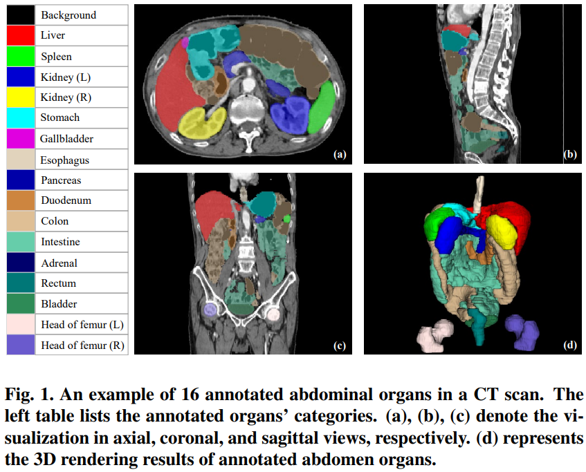

# 
 WORD: Revisiting Organs Segmentation in the Whole Abdominal Region ([Paper](https://arxiv.org/pdf/2111.02403.pdf) and [DataSet](https://drive.google.com/file/d/1HcRo3WARRXa_iBdFpo_4Z2s3z7PMzLlL/view?usp=sharing)).

* This repo provides the codebase and dataset of work **WORD: Revisiting Organs Segmentation in the Whole Abdominal Region**, and **the download requirement will be approved after the paper is accepted, stay tuned !!!**
* Now, we are preparing an online evaluation server for the fair and open research if you have experience with it or want to join or provide some support to this project, please contact us !!!
* Some information about the **WORD** dataset is  presented in the following:

Fig. 1. An example in the WORD dataset.

Fig. 2. Volume distribution or each organ in the WORD dataset.

Fig. 3.  User study based on three junior oncologists independently, each of them comes from a different hospital.

# DataSet
Please contact Xiangde Luo (luoxd1996 AT gmail DOT com) for the dataset. Two steps are needed to download and fully access the dataset: **1) using your google email to apply for the download permission**; **2) using your affiliation email to get the unzip password**. We will get back to you after the paper is accepted. We just handle the **real-name email** and **your email suffix must match your affiliation**. The email should contain the following information:

    Name/Homepage/Google Scholar: (Tell us who you are.)
    Primary Affiliation: (The name of your institution or university, etc.)
    Job Title: (E.g., Professor, Associate Professor, Ph.D., etc.)
    Affiliation Email: (the password will be sent to this email, we just reply to the email which is the end of "edu".)
    How to use: (Only for academic research, not for commercial use or second-development.)
    
In addition, this work is still ongoing, the **WORD** dataset will be extended to larger and more diverse (more patients, more organs, and more modalities, more clinical hospitals' data and MR Images will be considered to include future), any **suggestion**, **comment**, **collaboration**, and **sponsor** are welcome. 

# Acknowledgment and Statement
* This dataset belongs to the **Healthcare Intelligence Laboratory** at **University of Electronic Science and Technology of China** and is licensed under the [GNU General Public License v3.0](https://www.gnu.org/licenses/gpl-3.0.html).
* This project has been approved by the privacy and ethical review committee. We thank all collaborators for the data collection, annotation, checking, and user study!
* This project and dataset were designed for **open-available** academic research, **not** for clinical, commercial, second-development, or other use. In addition, if you used it for your academic research, you are encouraged to release the code and the pre-trained model.
* The interesting and memorable name **WORD** is suggested by [Dr. Jie-Neng](https://scholar.google.com/citations?user=yLYj88sAAAAJ&hl=zh-CN), thanks a lot !!!

# Citation
It would be highly appreciated if you cite our paper when using the **WORD** dataset or code:

    @article{luo2021word,
      title={WORD: Revisiting Organs Segmentation in the Whole Abdominal Region},
      author={Luo, Xiangde and Liao, Wenjun and Xiao, Jianghong and Song, Tao and Zhang, Xiaofan and Li, Kang and Wang, Guotai and Zhang, Shaoting},
      journal={arXiv preprint arXiv:2111.02403},
      year={2021}
    }
